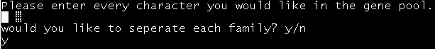
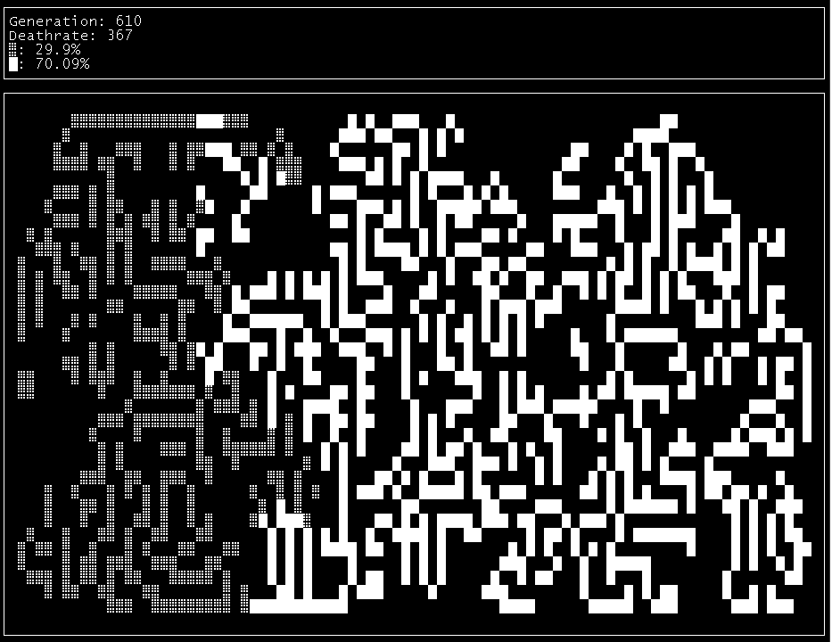
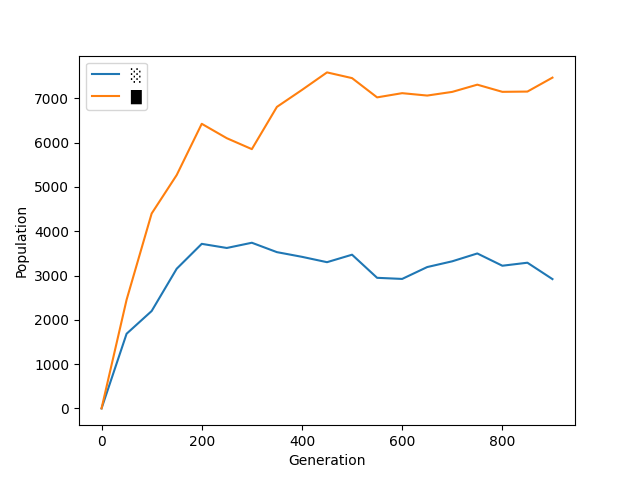

<h1 align="center">Curses Based Cellular Automata</h1>

Life simulation using ASCII characters in Linux Terminal or Windows Command Prompt.

## Links

- [Repo](https://github.com/Zadeson/Curses-Based-Cellular-Automata "Repo Page")

- [Bugs](https://github.com/Zadeson/Curses-Based-Cellular-Automata/issues "Issues Page")

## Screenshots

## Interactivity

At program startup, the app prompts the user to enter every character they want included in the 'gene pool'.

### `Please enter every character you would like in the gene pool.`

The app automatically parses the input to remove spaces and duplicate characters. 
Every character included in this input will automatically be shown in the table, as well as reactive cells on the grid. Once the program is terminated (via pressing 'q') a graph will display, showing the population of each gene/character with an appropriate legend.

### `would you like to seperate each family? y/n`

At the start of the program, every gene/character is randomly created in a set area, depending on the input of this prompt. If the user answers 'y', every gene will be evenly distributed along the x axis of the screen, with the same y value. If the user answers with 'n', every gene will be randomly created in a small box at the center of the screen. 

## Built With

- Python
  - windows-curses
  - time, random, os
  - matplotlib
  - numpy

## Future Updates

- [ ] More interactivity, possibly including a game-like function involving gambling.

## Author

**Ethen Dixon**

- [Profile](https://github.com/Zadeson "Zadeson")
- [Email](mailto:ethendixon@outlook.com?subject=Hi "Hi!")

## 🤝 Support

Contributions, issues, and feature requests are welcome!

Give a ⭐️ if you like this project!
