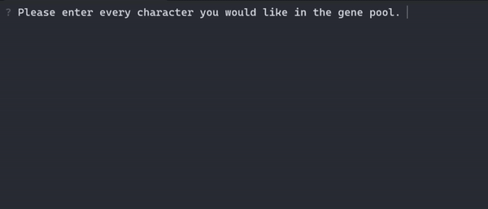

  </img>
   
  <a href="#"></img></a>
  <a href="https://creativecommons.org/licenses/by-nc-sa/4.0/"></img></a>
  <a href="#"></img></a>
  <a href="#"></img></a>

  
   
  <a href="https://github.com/Zadeson/Curses-Based-Cellular_automata/issues">Report a Bug</a> ·
  <a href="https://github.com/Zadeson/Curses-Based-Cellular-Automata/issues">Request Feature</a> ·
  <a href="https://github.com/Zadeson/Curses-Based-Cellular-Automata/pulls">Send a Pull Request</a>

## Curses Based Cellular Automata

<i>Life Simulation using Ascii Characters</i>

Available on Windows command prompt and Linux terminal!

## Features

* Customizable characters
* Clean UI
* Detailed "match" information

## Accepted Operating Systems

This has not been tested on every operating system, but has worked with:
- Linux
- Windows

## Built With

- Python
  - windows-curses
  - time, random, os
  - matplotlib
  - numpy

## Todo

- [ ] More interactivity, possibly including a game-like function involving gambling.
- [ ] Making the app more visually appealing
- [ ] Adding settings for the user to tweak to their preferences
- [ ] DNA for individual cells?

## Contributers

